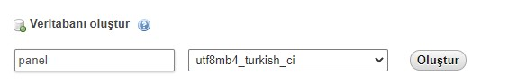
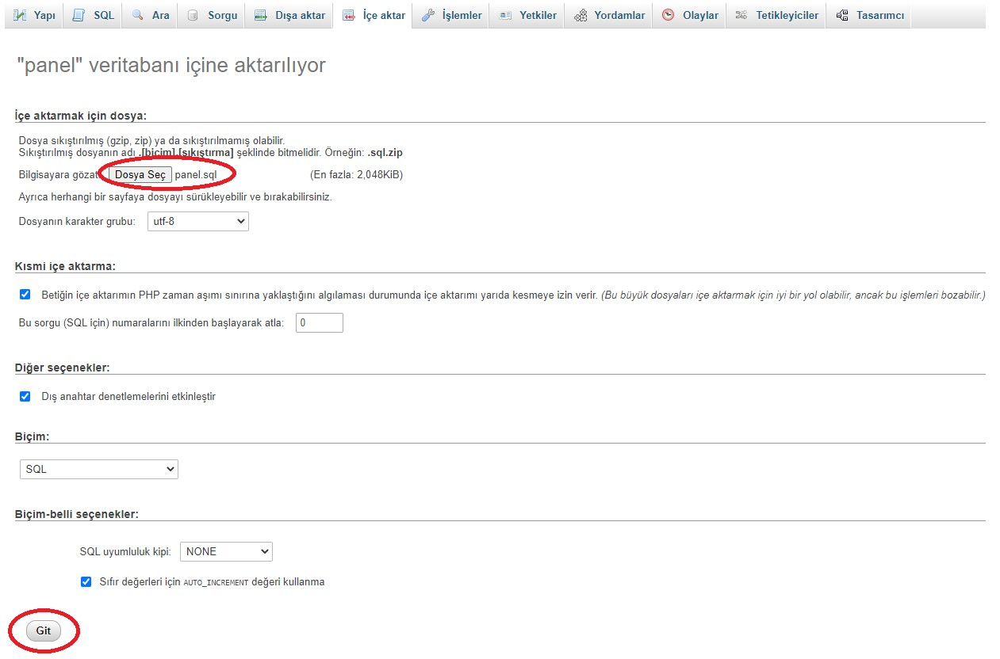

## Web Admin Panel

Upload the files to the server to use the admin panel.

For the admin panel to work, the sql file must be included in your system. For this, the panel.sql file in the SQL folder is used. A database called panel is created by going to phpMyAdmin.



After the database is created, the panel.sql file in the SQL folder is selected with the import feature and git is pressed.



As a last step, the netting/dbconfig.php file in the folder is opened and rearranged with your own information.

```php
<?php 
define('DBHOST','localhost');   // Host
define('DBUSER','root');        // phpMyAdmin username
define('DBPWD','sinan123');     // phpMyAdmin password
define('DBNAME','panel');       // database name
 ?>
```

Admin panel login username: sinanozcelik
Admin panel login password: sinan123

##  Contact Information

You can reach out to me using the following contact details:

[](mailto:sinanozcelik@yaani.com)

[](https://www.linkedin.com/in/sinan-ozcelik/)

I'm always open to development and collaboration. Feel free to reach out to me!
